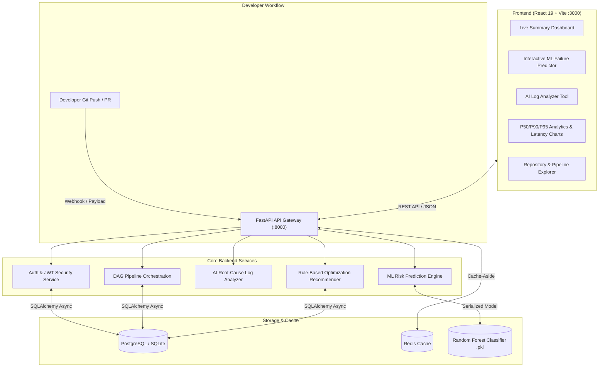

# INTELLI-CI — Intelligent CI/CD Optimization Platform

[](https://python.org)
[](https://fastapi.tiangolo.com)
[](https://react.dev)
[](https://tailwindcss.com)
[](https://scikit-learn.org)
[](https://www.postgresql.org)
[](https://redis.io)
[](https://docker.com)

> **INTELLI-CI** is an end-to-end intelligent CI/CD observability and optimization platform designed to eliminate pipeline bottlenecks, predict build failures proactively using Machine Learning, classify log anomalies using an automated AI rule engine, and recommend actionable pipeline optimizations.

---

## 📌 Problem Statement & Core Value

In modern agile software engineering, development teams push code dozens of times a day. As test suites expand and multi-stage pipelines grow, CI/CD cycles frequently degrade:
- **High Pipeline Latency:** Developers wait 15–30 minutes per commit, creating cognitive disruption and high cloud infrastructure costs.
- **Flaky & Repetitive Failures:** Build breakages caused by missing dependencies, syntax regressions, or configuration drift stall release velocity.
- **Lack of Pipeline Observability:** Teams lack clear percentile metrics (P50/P90/P95), stage duration breakdowns, and proactive risk warning before running expensive tests.

**INTELLI-CI resolves this by:**
1. **Pre-Execution Failure Prediction:** Evaluates git commit churn, author history, previous failures, and test coverage before running tests to estimate risk and suggest selective test execution.
2. **Automated Root-Cause Log Analysis:** Parses raw build logs to instantly classify failure categories (dependencies, Docker/daemon issues, Python syntax, etc.) and generate one-click fix suggestions.
3. **Continuous Optimization Engine:** Audits execution history across stages to calculate bottleneck stages and recommend concrete caching and parallelism optimizations.

---

## 🏛️ System Architecture



---

## 🧠 Machine Learning Engine

INTELLI-CI incorporates a calibrated `RandomForestClassifier` trained on commit metrics and pipeline history.

### Model Features (11 Dimensions):
| Feature | Type | Description |
|---|---|---|
| `files_changed` | int | Total number of files altered in the commit |
| `lines_added` | int | Total lines added |
| `lines_deleted` | int | Total lines removed |
| `code_churn` | int | Sum of additions and deletions |
| `previous_failures` | int | Number of recent failures on branch/repo |
| `test_coverage` | float | Current test suite code coverage percentage (0–100%) |
| `is_merge_commit` | int | Binary indicator (1 if merge, 0 if standard commit) |
| `commit_message_length` | int | Character length of the commit message |
| `num_contributors_last_30d` | int | Active contributor count on the repository |
| `days_since_last_failure` | float | Time elapsed since previous pipeline breakage |
| `recent_failure_flag` | int | 1 if a failure occurred in the last 24 hours |

### Decision Thresholds:
- **`RUN_TESTS`** ($P(\text{fail}) \ge 0.55$): High risk detected. Run the complete test suite.
- **`PARTIAL_TESTS`** ($0.30 \le P(\text{fail}) < 0.55$): Moderate risk. Run targeted fast unit tests.
- **`SKIP_TESTS`** ($P(\text{fail}) < 0.30$): Low risk detected (docs, small formatting). Recommend skipping non-essential stages to save compute.

---

## 📂 Project Structure

```
intelli-ci/
├── backend/                  # FastAPI Application
│   ├── ai/                   # AI Rule Engine for Log Analysis
│   ├── core/                 # App configuration & settings
│   ├── seed.py               # Comprehensive database seeder
│   ├── services/             # Core service controllers & endpoints
│   │   ├── api/main.py       # Main FastAPI application router
│   │   └── webhook/main.py   # Webhook ingestion service
│   ├── shared/               # Reusable DB models, auth, security & redis
│   │   ├── database/         # Async engine & session manager
│   │   ├── models/           # SQLAlchemy 2.0 ORM schemas
│   │   ├── security/         # JWT tokens & bcrypt password hashing
│   │   └── redis_client/     # Resilient Redis cache-aside client
│   └── tests/                # Automated pytest suite (24 unit tests)
│
├── frontend/                 # React 19 + Vite Single Page App
│   ├── src/
│   │   ├── pages/            # Dashboard, Analytics, Predict, Logs, Projects, Profile
│   │   ├── components/       # UI layout, charts, badges, modals
│   │   ├── services/api.js   # Unified Axios API client
│   │   └── context/          # React AuthContext & state providers
│   ├── package.json
│   └── vite.config.js        # Vite dev server with backend proxy
│
├── ml-engine/                # Machine Learning Pipeline
│   ├── dataset/              # Dataset generator (generate_dataset.py)
│   ├── models/               # Saved model (model.pkl)
│   ├── predictor/predict.py  # Standalone & API inference module
│   └── training/train.py     # Training script with Scikit-learn
│
├── devops/                   # Containerization & Nginx
│   ├── docker/               # Dockerfiles for backend & frontend
│   ├── nginx/nginx.conf      # Reverse proxy configuration
│   └── docker-compose.yml    # Multi-container orchestration
│
├── docker-compose.yml        # Root Docker Compose file
├── pytest.ini                # Pytest configuration
├── START.md                  # Quick run instructions
└── README.md                 # Project documentation
```

---

## 🚀 Getting Started

### 1. Prerequisites
- Python 3.12+
- Node.js 18+ and npm
- *(Optional)* Docker Desktop

### 2. Local Setup

```bash
# Clone the repository
git clone https://github.com/dorateja293/Intelli-CICD.git
cd Intelli-CICD

# Set up Python virtual environment
python -m venv venv
.\venv\Scripts\activate

# Install backend dependencies
pip install -r backend/requirements.txt

# (Optional) Retrain ML Model & Seed Database
python -m ml-engine.training.train
python backend/seed.py
```

### 3. Start Backend API
```bash
# In Terminal 1:
python -m uvicorn services.api.main:app --app-dir backend --host 0.0.0.0 --port 8000 --reload
```
- API is live at: `http://localhost:8000`
- Interactive Swagger UI: `http://localhost:8000/docs`

### 4. Start Frontend
```bash
# In Terminal 2:
cd frontend
npm install
npm run dev
```
- Frontend application is live at: `http://localhost:3000`

---

## 🐳 Docker Deployment

Run the entire stack with Docker Compose:

```bash
docker compose up --build -d
```

| Service | Address |
|---|---|
| **Frontend Web App** | http://localhost:3000 |
| **Backend REST API** | http://localhost:8000 |
| **PostgreSQL Database** | `localhost:5432` |
| **Redis Cache** | `localhost:6379` |

---

## 🧪 Automated Testing

Run the full pytest suite:

```bash
.\venv\Scripts\pytest.exe backend/tests -v
```

**Test Coverage Summary (24/24 passing):**
- ✅ Webhook Signature Validation (GitHub HMAC SHA-256, GitLab Tokens)
- ✅ Payload Normalization
- ✅ Pipeline DAG Ordering & Cyclic Dependency Detection
- ✅ AI Log Analysis Rule Engine (npm, Python, Docker daemon errors)
- ✅ Exponential Backoff Calculation
- ✅ ML Prediction Endpoints (`/api/v1/predict`)
- ✅ Analytics Endpoints (`/api/v1/analytics/durations`, `/stages`, `/failures`, `/trends`)
- ✅ Multi-service Health Endpoint (`/health`)

---

## 🔑 Demo Credentials

| Role | Email | Password | Access Scope |
|---|---|---|---|
| **Admin** | `admin@test.com` | `Admin123456` | Full Platform & User Administration |
| **Developer** | `developer@test.com` | `Developer123` | Pipeline Runs, Risk Prediction, Log Analyzer |
| **Viewer** | `viewer@test.com` | `Viewer123456` | Read-only Analytics & Dashboards |

*(Note: Unauthenticated demo mode is also enabled for quick evaluation).*

---

## 🎓 Academic / Placement Presentation Highlights

When presenting **INTELLI-CI**, highlight the following design patterns:
1. **Full-Stack Integration:** Real asynchronous communication from React 19 through FastAPI to PostgreSQL/Redis.
2. **Machine Learning in DevOps (MLOps):** How synthetic/historical commit features are extracted and evaluated with Random Forest classification to optimize compute utilization.
3. **Resilience & Fallback Architecture:** Graceful degradation on missing Kafka/Redis instances allowing deployment in both lightweight and enterprise environments.
4. **Actionable Insights:** Rather than just displaying graphs, the platform delivers computed recommendations (e.g. dependency caching, parallelization) with estimated time savings.

---

## 📄 License

This project is licensed under the MIT License.
